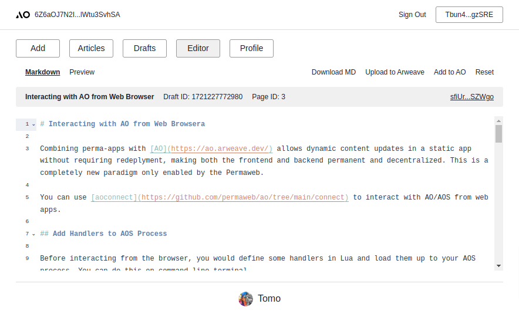
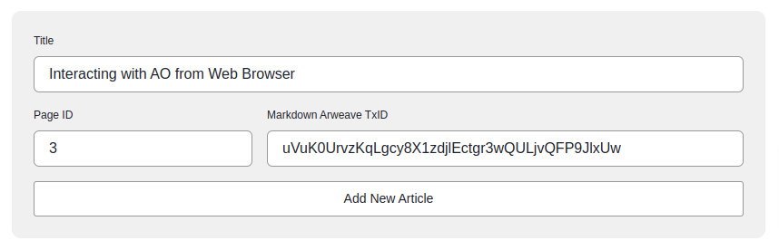

# PermaCMS on Arweave/AO

This is a permanent CMS deployed on Arweave and managed by AO.

The SPA instance needs to be deployed once and articles will be updated by the assigned AO process.

## Clone the Repo

```bash
git clone https://github.com/ocrybit/perma-cms.git
cd perma-cms
npm install
```

## Prepare AOS Process

In your terminal, go to the `lua` directory and start AOS.

```bash
cd lua
aos cms
```

Then load the lua script to add handlers to your process.

```bash
.load cms.lua
```
You need to take note of the `ao process` txid and you need to make the same Arweave owner account available in your browser. The keyfile should be located at `.aos.json` in your home directory. You can import this to the [Arconnect](https://www.arconnect.io/) browser extension.

you can quit the process with `Ctrl-C`. Now you are all set to run the CMS.

## `.env`

You could update the site owner profile later, but due to the static website nature, predefining site details in `.env` will allow social media / search engines to get and display the site information.

```bash
VITE_PROCESS_ID=6Z6aOJ7N2IJsVd7yNJrdw5eH_Ccy06cc7lWtu3SvhSA
VITE_TITLE=Tomo | Permaweb Hacker
VITE_DESCRIPTION=I hack, therefore I am.
VITE_IMAGE=https://arweave.net/3W4l7Q_w7r7bYlXH9MXAu2lascJm5YsPoCXn6BXGJ6U/cover.png
VITE_ICON=https://arweave.net/3W4l7Q_w7r7bYlXH9MXAu2lascJm5YsPoCXn6BXGJ6U/tomo.png
VITE_PROFILE_NAME=Tomo
VITE_PROFILE_DESCRIPTION=Permaweb Hacker
VITE_PROFILE_IMAGE=https://arweave.net/3W4l7Q_w7r7bYlXH9MXAu2lascJm5YsPoCXn6BXGJ6U/tomo.png
VITE_PROFILE_X=0xTomo
VITE_PROFILE_GITHUB=ocrybit
```

## Deploy on Arweave

Check if everything works.

```bash
yarn dev
```

You could create and update articles at [http://localhost:5173/#/admin](http://localhost:5173/#/admin), or you can do that later.

If everything is fine, build and deploy the app on Arweave.

```bash
yarn build
arkb deploy dist -w path_to_keyfile --auto-confirm
```

Now you get the app URL like [https://arweave.net/3W4l7Q_w7r7bYlXH9MXAu2lascJm5YsPoCXn6BXGJ6U](https://arweave.net/3W4l7Q_w7r7bYlXH9MXAu2lascJm5YsPoCXn6BXGJ6U).

## Manage Articles with Built-in Editor

You can go to the admin page at [https://your.app/#/admin](https://your.app/#/admin), and connect the owner wallet, and start writing articles with the simple built-in editor. You can perform the following actions.

- Download the MD file
- Upload articles to Arweave
- Add articles to AO (CMS)
- [bonus] Update your profile



## Upload Markdown Files to Arewave

In case of using the built-in editor, just hit the `Upload to Arweave` button.

You could also import markdown files created with external editors like [HackMD](https://hackmd.io), and upload them to Arweave.

You can use `arkb` to do so.

```bash
arkb deploy doc.md -w path_to_keyfile --auto-confirm
```

## Add Articles to AO

Then go to the admin page at [https://your.app/#/admin](https://your.app/#/admin) and add the `TxID` to your AO process with a `Title` and an arbitrary `Page ID`.

Note that only the AO process owner can update, so you need to connect the same account that deployed the process.



Now you can access your article at [https://arweave.net/3W4...6U/#/a/3](https://arweave.net/3W4l7Q_w7r7bYlXH9MXAu2lascJm5YsPoCXn6BXGJ6U/#/a/3).

Also, it will be listed on the top page at [https://arweave.net/3W4...6U](https://arweave.net/3W4l7Q_w7r7bYlXH9MXAu2lascJm5YsPoCXn6BXGJ6U).


